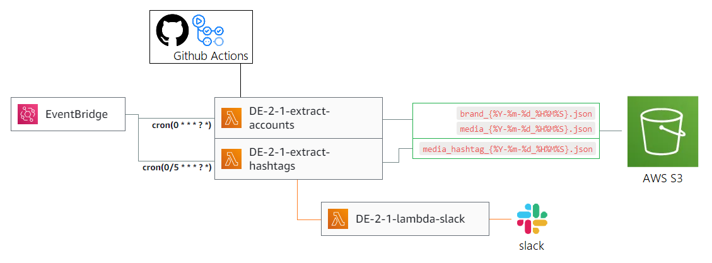
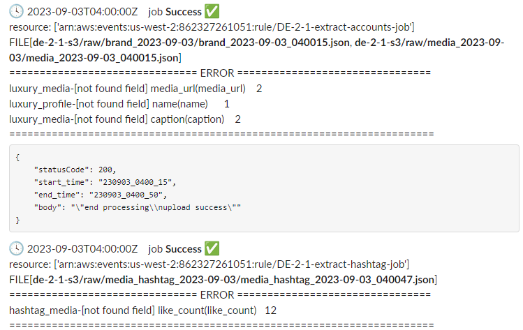

# LuxuryBrands_DataCollector

 

[Instagram Graph API](https://developers.facebook.com/docs/instagram-api)를 통한 데이터를 수집 및 적재



- API 응답 데이터에 대한 검증 및 필드 전처리 후 JSON포맷으로 S3에 적재
- Github Actions를 이용하여 CI/CD 및 AWS Lambda 업데이트

<br>

## 1. 데이터 수집
다음 11개 브랜드 명에 대해 데이터 수집.

    #hermes #chanel #dior   #louisvuitton   #gucci  #prada  #ysl    #celine #valentino  #miumiu #fendi

- 1시간 마다 [비즈니스 검색 API]()를 통해 프로필 데이터 및 최신 25개의 미디어 데이터 수집
- 5분 마다 [해시태그 검색 API]()를 통해 최신 25개의 해시태그 미디어 데이터 수집
- 각 `brand`, `media`, `media_hashtag` 세 가지 모델로 데이터틀 저장
- 응답 필드가 존재하지 않는 경우 default값을 부여

<br>

## 2. 데이터 품질 체크
- 수집대상, 맵핑필드, 저장 포맷 등의 메타데이터를 `configure.ini` 파일로 일괄 관리
- 필수 데이터 존재 유무 및 필드 데이터 타입, 데이터 포맷, 도메인 일치 여부 검증
- 데이터 이상 발생 시 해당 데이터 필드 또는 레코드 제외 

<br>

## 3. 로깅


- 데이터 적재 성공 실패 여부
- 데이터 필드 또는 레코드 이상 내역을 집계


<br>

## 4. 폴더구조

```
.
├─ dev_logs
├─ sample_data
├─ source
├─ tests
├─ README.md
├─ configure.ini
├─ required_files.txt
└─ requirements.txt
```
|     Name      | Explanation      |
|:-------------:|:-----------------|
|  `dev_logs`   | 개발 중 기록 문서       |
| `sample_data` | 수집 데이터 샘플        |
|   `source`    | Lambda 데이터 수집 코드 |
|   `tests`     | 테스트 스크립트         |
